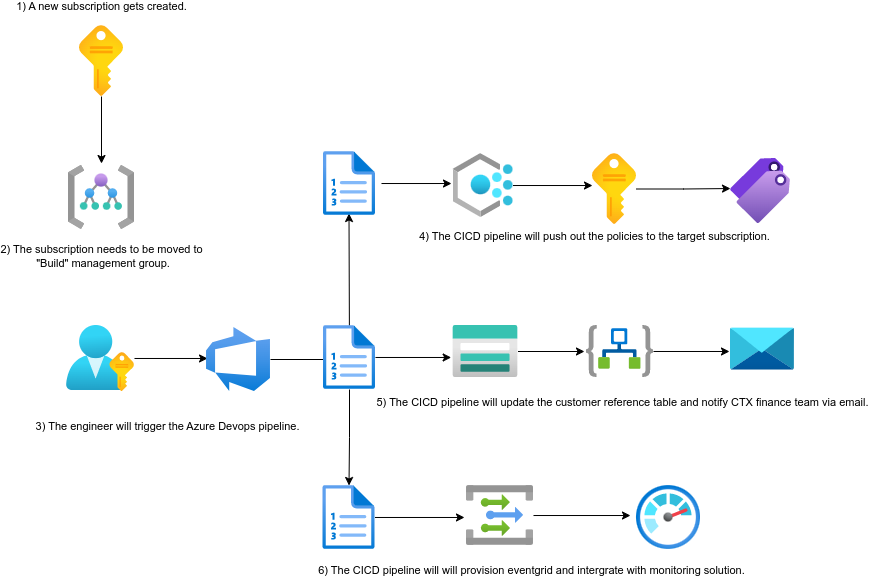
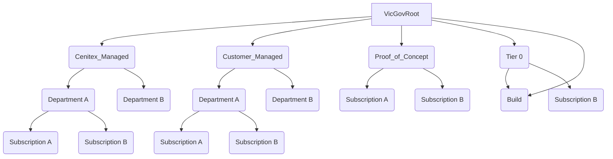

# VICGOV - Azure Policy as Code Workflow

## Table of Contents
1. [Introduction](#1-introduction)
   1. [Overview](#11-overview)
2. [Logical Architecture](#2-logical-architecture)
   1. [Logical System Component Overview](#21-logical-system-component-overview)
3. [Management Group Structure](#3-management-group-structure)
   1. [Management Group Structure Overview](#31-management-group-structure-overview)
4. [Tagging](#4-tagging)

## 1. Introduction
### 1.1 Overview

The VICGOV - Azure Policy as Code Workflow was developed to address outstanding Azure charges and improve the onboarding process for new subscriptions. This document provides a high-level overview of the workflow, including policies for tags, updating customer billing reference tables, and configuring Azure monitoring. It also includes a detailed troubleshooting guide.

## 2. Logical Architecture
### 2.1 Logical System Component Overview

The logical architecture of the VICGOV - Azure Policy as Code Workflow is as follows:

1. A new subscription is created.
2. The subscription is moved to the "Build" management group.
3. An engineer triggers the Azure DevOps pipeline.
4. The CI/CD pipeline pushes out the policies to the target subscription.
5. The CI/CD pipeline updates the customer reference table and notifies the CTX finance team via email.
6. The CI/CD pipeline provisions Event Grid and integrates it with the monitoring solution.

## 3. Management Group Structure
### 3.1 Management Group Structure Overview
The management group structure is represented using the following diagram:

## 4 Tagging
The following section lists tags required at a subscription level.  Alternatively, a custom policy can be used to automatically tags all resource groups with these tags. 

|Tag|Description|Example|Required/Optional
|---|-----------|-------|-----------------
Rate|Cenitex Premium Service Charge|1.25|Required
Department|Department Name|Cenitex|Required
Contact|Customer Name|john.dow@dpc.vic.gov.au|Required
Application|Business Application Name|CM9|Required
ProjectCode|Associated Project Code|CUS1234|Required
ProjectManager|Associated Project Manager|john.dow@cenitex.vic.gov.au|Required
BusinessUnit|Business Unit Name that Owns the Subscription|Hosting Platform Services|Required
